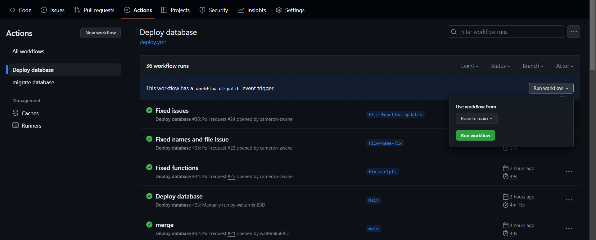

# TaskIt
Like uber but for chores, allows users to request a person to perform a task 
for them such as cleaning, doing laundry etc. for a fee. 

## Technologies Used
- Git and GitHub: Source control
- Flyway: Database migration tool
- GitHub Actions: CI/CD pipeline
- AWS RDS: Relational Database Service - Postgres
- Open-Tofu: Infrastructure as Code (IaC) tool

## Recreating the project

### Implementing Source Control

This project uses Git as a source control with GitHub to act as the central point. This
enables the project stakeholders to collaborate and makes the pipeline implementation easier 
with GitHub Actions.

The first step will be to create an GitHub organization. Organizations will be needed
when implementing the AWS RDS section of the project. To create the organization, the
GitHub docs should be followed. This will be the most up to date resource. 

To create an organization, visit [GitHub Organizations](https://docs.github.com/en/organizations/collaborating-with-groups-in-organizations/creating-a-new-organization-from-scratch).

After creating an organization and adding in the stakeholders of the project, it is time to
create the project itself. This process is also available through the GitHub's documentation. For a guided
tutorial, visit [GitHub Project Creation](https://docs.github.com/en/issues/planning-and-tracking-with-projects/creating-projects/creating-a-project).

Once these steps have been completed, the source control will be up and running. Now the 
project needs to be cloned to a local machine, so that development can start. The following
command is used to clone a GitHub project.

```commandline
git clone <project-url>
```

### Setting Up The SQL Scripts

The SQL scripts will be the meat of the dish. Creating the scripts themselves is the 
easy step. It will be the planning that eats up most of your time in this section.

The first thing to do is to start planning an ERD on the business idea. The process 
involves the creation and refinement of business rules, and the type of system planned. 
TaskIt is, at its core, a Booking system. The ERD outlines the fundamental parts
of the business:


Once the ERD is fleshed out, it is time to create the SQL scripts to impelemnt the 
diagram. Postgresql was selected as the Database Implementation and thus the scripts
written also followed Postgresql SQL.

A typical script will look like this and it outlines how the Bookings
ERD table can be translated into sql code. The table will describe the
relationships and data.

```postgresql
CREATE TABLE IF NOT EXISTS task_it.bookings (
    booking_id SERIAL CONSTRAINT pk_bookings PRIMARY KEY,
    customer_id INTEGER NOT NULL,
    address_id INTEGER NOT NULL,
    status_id INTEGER NOT NULL,
    booking_date TIMESTAMP NOT NULL,
    CONSTRAINT fk_customers_bookings
        FOREIGN KEY(customer_id)
            REFERENCES task_it.customers(customer_id),
    CONSTRAINT fk_addresses_bookings
        FOREIGN KEY(address_id)
            REFERENCES task_it.addresses(address_id),
    CONSTRAINT f_statuses_bookings
        FOREIGN KEY(status_id)
            REFERENCES task_it.statuses(status_id)
);
```

Because Flyway is used as a migration tool, that means that the file
cannot just be saved in any way. A specific structure is needed. The
structure is as follows:

```
db
└── migrations
    ├── V001__create_schema.sql
    ├── V002__create_customers_table.sql
    ├── V003__create_addresses_table.sql
    └── ...
```

The V001 is what tells Flyway in what order to run the scripts. Flyway
has a few common conventions it allows for, but the convention chosen by
TaskIt was V003__create_addresses_table.sql

Flyway does allow for customization of the folder structure by using the 
location keyword when specifying where to look for migration scripts.

### Open-Tofu and Setting Up the Infrastructure

Open-Tofu is an open-source fork of Terraform and it is used to 
control the infrastructure of the cloud solution being used.

The infrastructure will handle the creation and update of AWS RDS instances
as well as the maintenance and re-deployment. To start of, create a folder
to house all of the configuration files. It should look as follows:

```postgresql
db
└── infra
    ├── .terraform.lock.hcl
    ├── main.tf
    └── variables.tf
```

This houses all of the logic for maintaining infrastructure and
can be used to handle all of the day-to-day of running a cloud solution.

The general breakdown of each files consists of:

1. main.tf:  

This file is the main configuration file for your 
Terraform project. It contains the actual infrastructure configuration 
written in HashiCorp Configuration Language (HCL). In this file, you 
define the resources you want to create, update, or delete. In the context 
of your database infrastructure, you would likely define things like database 
instances, security groups, subnets, and other related resources.

2. variables.tf: 

This file is used to declare input variables for
your Terraform configuration. Input variables allow you to parameterize 
your Terraform configurations, making them more flexible and reusable. 
Instead of hardcoding values directly into your configuration files, 
you can define variables in this file and then reference them throughout 
your main.tf file. For example, you might have variables for things like database 
instance size, instance type, database name, etc.

3. .terraform.lock.hcl: 

This file is related to Terraform's dependency 
lock mechanism. It's automatically generated and managed by Terraform 
to lock down the specific versions of provider plugins and modules 
that are being used in your project. This helps ensure that your 
infrastructure is consistently deployed across different 
environments and by different team members.

In TaskIt, there are two resources being managed. AWS RDS and S3.
Here is the code for manipulating the resources:

```
terraform {
  required_providers {
    aws = {
      source = "opentofu/aws"
      version = "~> 5.36"
    }
  }

  required_version = ">= 1.2.0"

  backend "s3" {
    bucket = "taskit-bucket-i"
    key = "infra/states"
    region = "eu-west-1"
  }
}

provider "aws" {
  region = "eu-west-1"
}

resource "aws_db_instance" "taskit_db" {
  allocated_storage = 5
  db_name = var.DB_NAME
  engine = "postgres"
  engine_version = "15.2"
  identifier = "taskit-db"
  instance_class = "db.t3.micro"
  username = var.DB_USERNAME
  password = var.DB_PASSWORD
  publicly_accessible = true
  skip_final_snapshot = true
}
```

### AWS RDS and S3

While Open-Tofu handles most of the management of the resources, the AWS
are used to create the IAM (Identity Access Management) Roles. This is 
to give the GitHub Actions Runners access the the AWS account as to deploy 
and migrate the needed infrastructure. 

The following roles are given to comply with the least-access common practice:
- AmazonRDSDataFullAccess
- AmazonRDSFullAccess
- AmazonS3FullAccess

This is so that only S3 and RDS can be managed. Because the IAM Roles ARN is
a sensitive piece of data, but needs to be exposed to the GitHub Runner, GitHub
secrets must be used to keep cloud access safe. To create github secrets, the 
GitHub documentation will once again come in handy. Visit [GitHub Secrets](https://docs.github.com/en/actions/security-guides/using-secrets-in-github-actions) 
for instructions on how to set GitHub secrets.


### Setting Up Flyway with AWS and GitHub Actions

Flyway is a tool that can be used locally, but because the goal is
to have a fully functioning pipeline that will automatically migrate
an AWS RDS on every merge into main, setting it up will pose a few more 
challenges.

The previous GitHub secrets will also be handly when setting up the 
GitHub Job. The following secrets will be needed to run a Flyway migration 
on AWS:
- AWS_RDS_ENDPOINT
- DB_PORT
- DB_NAME
- DB_USERNAME
- DB_PASSWORD

A migration job is split into two steps. Installing Flyway so that 
the runner will recognize the program and the migration job. The final 
product should be the following:

```yaml
name: migrate database
on: 
    push:
        branches: 
            - main
jobs:
    migrate: 
        runs-on: ubuntu-latest
        defaults: 
            run:
                shell: bash
                working-directory: .
        steps:
            - name: repo setup
              uses: actions/checkout@v3
              
            - name: flyway setup
              run : |
                wget -qO- https://download.red-gate.com/maven/release/com/redgate/flyway/flyway-commandline/10.7.2/flyway-commandline-10.7.2-linux-x64.tar.gz | tar -xvz && sudo ln -s `pwd`/flyway-10.7.2/flyway /usr/local/bin
            
            - name: flyway migrations
              run: |
                flyway -url=jdbc:postgresql://${{ secrets.AWS_RDS_ENDPOINT }}:${{ secrets.DB_PORT }}/${{ secrets.DB_NAME }} -user=${{ secrets.DB_USERNAME }} -password=${{ secrets.DB_PASSWORD }} -locations=filesystem:$(pwd)/db/migrations migrate
```

Using this script, a migration will happen after every push to the
main branch.

- setting up open-tofu and connecting that to aws

## Deployment

Deploying the Database is as simple as pressing a button. After the 
Open-Tofu code has been completed, navigate to the Actions section and
deploy the RDS Database by pressing the 'Run Workflow' Button. 

